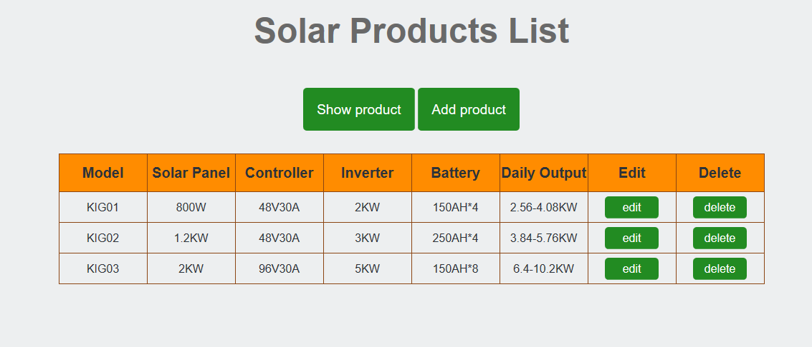
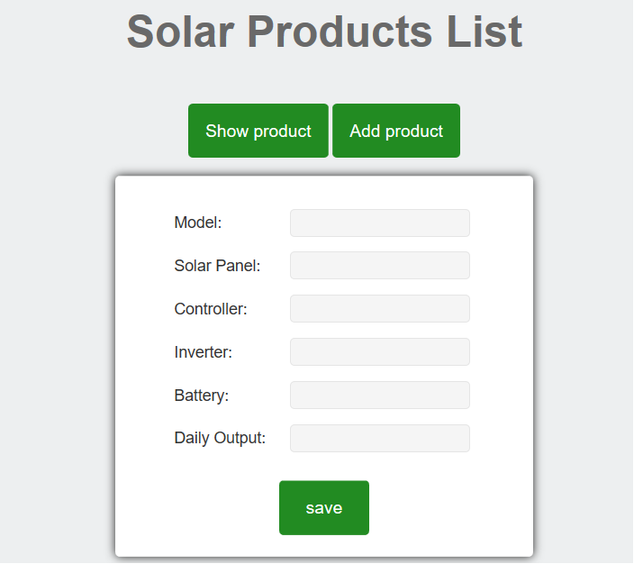
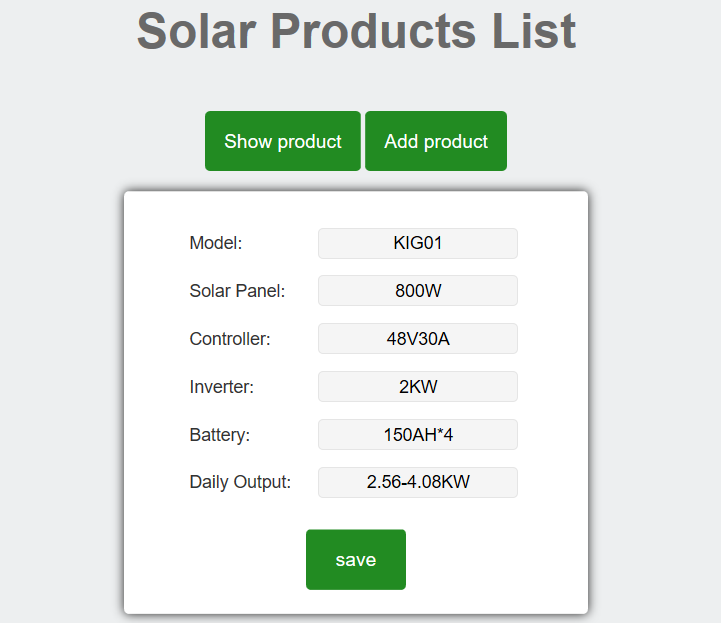
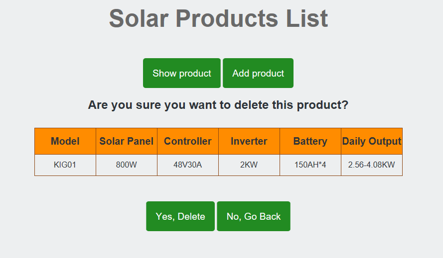

<h1 id="solarApp">solarApp</h1>
<ul>
  <li><a href="#synopsis">Synopsis</a></li>
  <li><a href="#requirements">Requirements</a></li>
  <li><a href="#installation">Installation</a></li>
  <li><a href="#contributing">Contributing</a></li>
</ul>
<h2 id="synopsis">Synopsis<a href="#solarApp">Go back to the top</a></h2>
This is an app that showcases solar products' information. It's based on Mongodb+Express.js+Angular+Node.js.

When clicking the "Add product" button, you can add new product to the list:

When clicking the "edit" button, you can edit the current product:

When clicking the "delete" button, you can delete the current product:

<h2 id="requirements">Requirements<a href="#solarApp">Go back to the top</a></h2>

solarApp requires the following to run:

<ul>
  <li>node.js</li>
  <li>npm</li>
  <li>mongodb</li>
</ul>

<h2 id="installation">Installation<a href="#solarApp">Go back to the top</a></h2>
<ol>
  <li>Clone or download it</li>
  <li>Run Mongodb</li>
  <li>Install Dependencies(npm install)</li>
  <li>Run the Application(node ./bin/www)</li>
  <li>Launch your browser and navigate to: http://localhost:3000</li>
</ol>

<h2 id="contributing">Contributing<a href="#solarApp">Go back to the top</a></h2>
<ol>
  <li>Fork it</li>
  <li>Create your feature branch</li>
  <li>Commit your changes</li>
  <li>Push to the branch</li>
  <li>Create new Pull Request</li>
</ol>
